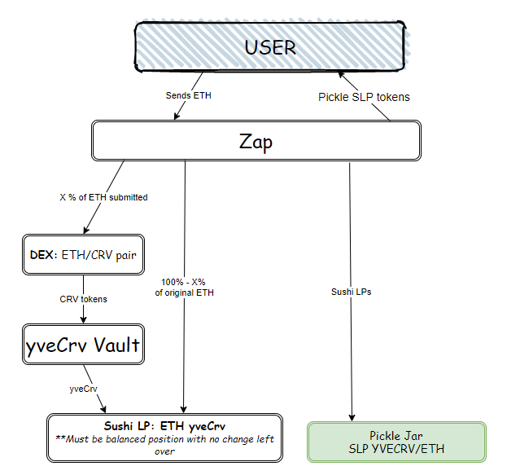

# Zap to go from ETH or CRV to Pickle Jar: SLP YVECRV/ETH

This zap allows a user to make a single sided deposit via either ETH or CRV.  
**Eth Route:** eth => crv => yvecrv => sushi lp => pickle jar  
**Crv Router** crv => yvecrv => sushi lp => pickle jar  

Requirements
- [x] Zap from ETH
- [x] Zap from CRV
- [x] Dust for all zaps never exceeds `1e12` CRV/ETH
- [ ] Detect if optimal to depost in yveCRV vs swap

