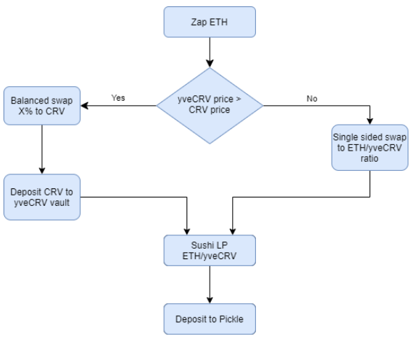
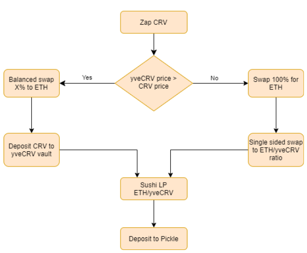

# Zap to go from ETH or CRV to Pickle Jar: SLP YVECRV/ETH

This zap allows a user to make a single sided deposit via either ETH or CRV. Zap will follow the most economically efficient route to get user into a Sushiswap ETH/yveCRV position and then deposit into the associated Pickle Jar.

### Tests
Tests should be run separately because each throws DEX pair balances off considerably. We want each to start fresh with actual pair reserves.
- For ETH zaps: `brownie test tests/test_zap_eth.py -s`
- For CRV zaps: `brownie test tests/test_zap_crv.py -s`

### Requirements
- [x] Zap from ETH
- [x] Zap from CRV
- [x] Dust for all zaps never exceeds `1e12`
- [x] Detect optimal route to yveCRV: vault deposit vs swap

### Zap ETH Route

### Zap CRV Route
